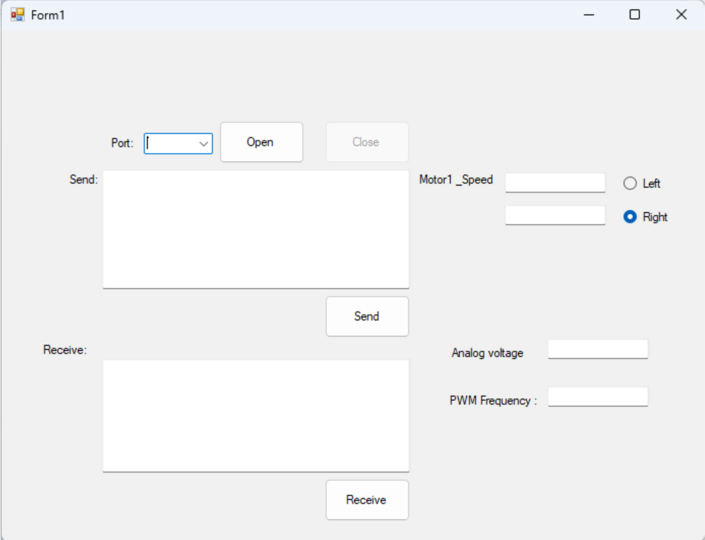

#STM32F401RE Robot Controller with Windows Forms UI

[](https://opensource.org/licenses/MIT)
[](https://www.st.com/en/microcontrollers-microprocessors/stm32f401re.html)
[](https://dotnet.microsoft.com/)

A complete robot control system featuring STM32F401RE firmware and a Windows Forms desktop application with real-time UART communication.


<p align="center">
  
</p>

---

#  Table of Contents

- [Features](#-features)
- [Hardware Requirements](#-hardware-requirements)
- [Pin Configuration](#-pin-configuration)
- [Communication Protocol](#-communication-protocol)
- [Project Structure](#-project-structure)
- [Installation](#-installation)
- [Commands](#-commands)
- [Troubleshooting](#-troubleshooting)
- [Technical Details](#-technical-details)
- [Authors](#-authors)
- [License](#-license)

---

# Features

## STM32 Firmware
- PWM motor control using TIM3 Channel 1
- Adjustable duty cycle from 0% to 100%
- 12-bit ADC sensor reading
- Frequency and period measurement using TIM4
- Digital input and output control
- 1ms system timer interrupt
- UART command parser with `\r\n` delimiters

## Windows Forms Application
- Real-time motor speed slider
- Live ADC monitoring
- Frequency measurement display
- Digital I/O control panel
- UART communication log window
- Automatic COM port detection

---

#  Hardware Requirements

| Component | Description |
|-----------|-------------|
| STM32F401RE Nucleo Board | Main controller |
| USB-to-TTL Converter | UART communication |
| DC Motor | Robot actuator |
| Motor Driver (L298N) | PWM motor control |
| Analog Sensor | ADC input source |
| Encoder / Signal Source | Frequency measurement |
| LED / Relay | Digital output |
| Push Button | Digital input |

---

#  Pin Configuration

```text
┌─────────── STM32F401RE Nucleo-64 ───────────┐
│                                             │
│ PA1   (ADC1_IN1)    ← Analog Sensor         │
│ PA2   (USART2_TX)   → UART to PC            │
│ PA3   (USART2_RX)   ← UART from PC          │
│ PA5   (LED2)        → Built-in LED          │
│ PB0   (GPIO_OUT)    → Relay / Direction     │
│ PB1   (GPIO_IN)     ← Push Button           │
│ PB10  (TIM2_CH3)    ← Encoder Input         │
│ PC6   (TIM3_CH1)    → PWM Output            │
│ PC13  (B1)          ← User Button           │
│                                             │
└─────────────────────────────────────────────┘
```

## Clock Configuration

```text
HSI 16MHz → PLL
SYSCLK: 84MHz
HCLK:    84MHz
APB1:    42MHz
APB2:    84MHz
ADC CLK: 21MHz
```

## Timer Settings

| Timer | Prescaler | Period | Function |
|-------|-----------|--------|----------|
| TIM2 | 83 | 999 | 1ms system tick |
| TIM3 | 83 | 999 | PWM generation |
| TIM4 | 83 | 65535 | Period measurement |

---

#  Communication Protocol

**Interface:** UART2  
**Baud Rate:** 115200  
**Format:** 8N1

## Command Format

```text
<COMMAND> [PARAMETER]\n
```

## Command Reference

| Command | Parameter | Response | Description |
|---------|-----------|----------|-------------|
| `PING` | - | `PONG` | Connection test |
| `ADD n` | Integer | `ADD n+1` | Arithmetic test |
| `OUT n` | 0 or 1 | `IN 0/1` | Set PB0 and read PB1 |
| `PWM n` | 0-100 | `PWMOK n` | Set PWM duty cycle |
| `ADC?` | - | `ADC n` | Read ADC value |
| `MEAS?` | - | `PER n` | Read signal period |
| Invalid | - | `ERR` | Unknown command |

---

#  Project Structure

```text
STM32-Robot-Controller/
├── firmware/
├── desktop/
├── docs/
├── .gitignore
├── LICENSE
└── README.md
```

---

#  Installation

## Prerequisites

### Firmware
- STM32CubeIDE
- ST-Link USB Driver

### Desktop Application
- Visual Studio 2019
- .NET Framework 4.8 SDK
- Windows 10 or Windows 11

---

#  Authors

- Sahand Masoudi 
- Haami Jahanian 

---

# 📄 License

This project is licensed under the MIT License.
